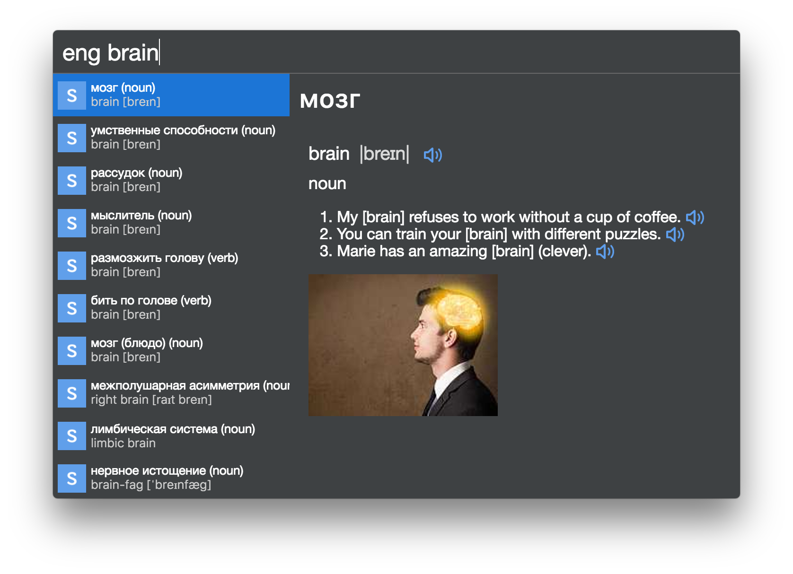

# cerebro-skyeng 

> [Cerebro](http://www.cerebroapp.com) plugin for English ⇄ Russian translation using API of skyeng.ru

Shows English ⇄ Russian translations with transcription, pronunciation, images and examples.

## Usage

In Cerebro, type `eng` and some word, that you want to translate.

## Related

- [Cerebro](http://github.com/KELiON/cerebro) – main repo for Cerebro app;
- [create-cerebro-plugin](https://github.com/KELiON/create-cerebro-plugin) - create Cerebro plugins with no configuration .

## License

MIT © [Alexandr Subbotin](http://asubbotin.ru)
